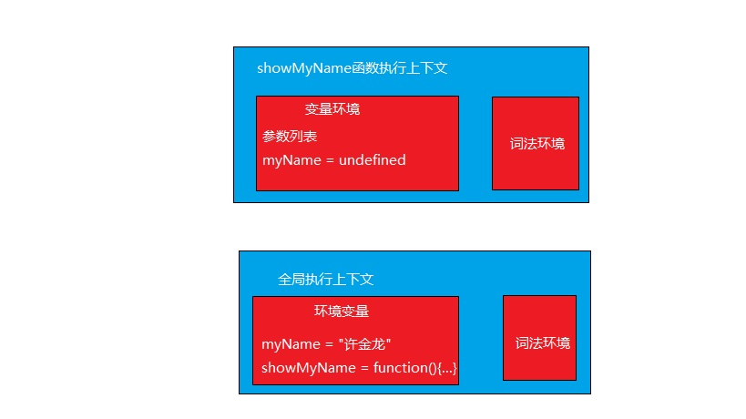

## 一：ES6 简介

### 1：什么是 ES6

## 二：ES6 新特性

### <b>1：let、const 和块级作用域</b>

- let 用来声明变量。它的用法类似于 var，但是所声明的变量，只在 let 命令所在的代码块内有效
- const 声明一个只读的常量。一旦声明，常量的值就不能改变。
- <font color=red>为什么要引入 let 和 const 呢？,let、const 实际上为 JavaScript 新增了块级作用域。为什么需要块级作用域？</font>。

Javascript 只有全局作用域和函数作用域， 在设计初的时候存在变量提升这种缺陷,变量提升会带来什么问题呢？

1. <b>变量容易在不被察觉的情况下被覆盖</b>,如下面的代码为什么没有预想打印出"许金龙"，而答应出"undefined"呢？

```js
var myName = "许金龙";
function showMyName() {
  if (false) {
    var myName = "xjl";
  }
  console.log(myName);
}
showMyName();
```

调用栈

因为变量提升，会生成 myName = undefined 的变量定义，在查找变量的时候会使用函数上下文里面的变量

2. <b>本应销毁的变量没有被销毁</b>,看看下面的代码

```js
function showIndex() {
  for (var i = 0; i < 5; i += 1) {
    console.log("index", i);
  }
  console.log("i", i);
}
showIndex();
```

- let、const 的特性

1. 不存在变量提升
2. 暂时性死区,如果区块中存在 let 和 const 命令，这个区块对这些命令声明的变量，从一开始就形成了封闭作用域。凡是在声明之前就使用这些变量，就会报错。

```js
var tmp = 123;

if (true) {
  tmp = "abc"; // ReferenceError: Cannot access 'tmp' before initialization
  let tmp;
}
```

3. 不允许重复声明,let 不允许在相同作用域内，重复声明同一个变量。

- 关于 const 的说明

1. 定义了之后就不能改变，const 实际上保证的，并不是变量的值不得改动，而是变量指向的那个内存地址所保存的数据不得改动。对于简单类型的数据（数值、字符串、布尔值），值就保存在变量指向的那个内存地址，因此等同于常量。但对于复合类型的数据（主要是对象和数组），变量指向的内存地址，保存的只是一个指向实际数据的指针，const 只能保证这个指针是固定的（即总是指向另一个固定的地址），至于它指向的数据结构是不是可变的，就完全不能控制了。

```js
const person = {};
person.name = "xjl"; // 成功
person = {}; // Uncaught SyntaxError

const persons = [];
persons.push([{ name: "xjl" }]); // 成功
persons = []; // Uncaught SyntaxError:
```

2. 对于 const 来说，只声明不赋值，就会报错

```js
const myName;// Uncaught SyntaxError
```

### <b>2：变量的解构赋值</b>

按照一定模式，从数组和对象中提取值，对变量进行赋

- 数组结构

1. 基本用法

```js
let name = "xjl";
let age = 33;
let [name, age] = ["xjl", 33];
```

```js
let list = [1, 2, 3, 4];
let [first, second, third, fourth] = list; // 全部解构
let [, second] = list; // 只结构需要的值
let [first, ...others] = list; // 结构成一个数组
let [first, second, third, fourth, five] = list; // 如果结构不成功，默认会是undefined
```

2. 可解构性，数组解构，只要满足可迭代性（Iterator 接口）都是可以解构的，ES6 规定，默认的 Iterator 接口部署在数据结构的 Symbol.iterator 属性，或者说，一个数据结构只要具有 Symbol.iterator 属性，就可以认为是“可遍历的”（iterable）。原生具备 Iterator 接口的数据结构如下。Array、Map、Set、String、TypedArray、函数的 arguments 对象、NodeList 对象。

```js
var list = document.getElementsByClassName("c-container");
// list原型链对象，具有Symbol.iterator属性，所以是可迭代的，可以数组解构
HTMLCollection {Symbol(Symbol.toStringTag): "HTMLCollection", item: ƒ, namedItem: ƒ, constructor: ƒ, …}
length: (...)
item: ƒ item()
namedItem: ƒ namedItem()
constructor: ƒ HTMLCollection()
Symbol(Symbol.toStringTag): "HTMLCollection"
Symbol(Symbol.iterator): ƒ values()
get length: ƒ length()
__proto__: Object
```

3. 默认值，解构赋值允许指定默认值

```js
var [first, second = 3] = [1];
var [first, second = 3] = [1, null]; //ES6 内部使用严格相等运算符（===），判断一个位置是否有值。所以，只有当一个数组成员严格等于undefined，默认值才会生效,所以null的默认值就不生效
var defaultSecond = 3;
var [first, second = defaultSecond] = [1]; // 默认值可以引用解构赋值的其他变量，但该变量必须已经声明。
```

- 对象解构

1. 基本用法

```js
const { name, age } = { name: "xjl", age: 33 }; // 变量名和属性名必须一致
```

2. 变量名和属性名不一致

```js
const { name: persoName, age: personAge } = { name: "xjl", age: 33 }; // 如果变量名和属性名不一致
```

从上面可以看出属性解构的正确格式应该是下面这个,上面的是一种简写

```js
const { name: name, age: age } = { name: "xjl", age: 33 }; // 所以说这是对象解构的标准格式，平常的是简写，这个不是赋值，如果这种用在数组中就会报错
const [name: personName] = ["xjl"]; // Uncaught SyntaxError
```

### <b>3：类型的扩展</b>

- 字符串的扩展

1. 模板字符串，
   模板字符串是增强版的字符串，用反引号（`）标识。它可以当作普通字符串使用，也可以用来定义多行字符串，或者在字符串中嵌入变量。

   ```js
   var strValue = `Print hello world`; // 基本用法

   var strValue = `
   Print
   hello world
   `; // 多行字符串

   var str = "hello world";
   var strValue = `Print ${str}`; // 嵌套变量

   var totalNum = `2+3 is:${2 + 3}`; // 可以嵌套表达式、调用函数
   ```

- 函数的扩展

1. 默认赋值和参数解构

```js
function personInfo(name, age = 18) {
  // 默认值
  console.log(`${name}:${age}`);
}
personInfo("xjl");

function personInfo({ name, age = 18 }) {
  console.log(`${name}:${age}`);
}
personInfo({ name: "xjl" });
```

2. rest 参数,rest 参数（形式为...变量名），用于获取函数的多余参数，这样就不需要使用 arguments 对象了。rest 参数搭配的变量是一个数组，该变量将多余的参数放入数组中。

```js
function getTotal(...argus) {
  var total = 0;
  if (argus && argus.length) {
    argus.forEach(function (item) {
      total += item;
    });
  }
  return total;
}
```

3. 箭头函数,使用“箭头”（=>）定义函数。

```js
function showMyName() {
  // ES5定义
  // ...
}
const showMyName = () => {
  // 箭头函数定义
  // ...
};
```

```js
const showMyName = (name) => {
  return name;
};

// 如果直接返回的话，可以省略“{}”和return
const showMyName = (name) => name;
```

- 函数体内的 this 对象，就是定义时所在的对象，而不是使用时所在的对象。

```js
function showId() {
  //setTimeout( ()=> {
  setTimeout(function () {
    console.log("id:", this.id);
  }, 100);
}
var id = 21;
showId.call({ id: 42 });
```

- 不可以当作构造函数，也就是说，不可以使用 new 命令，否则会抛出一个错误。
- 不可以使用 arguments 对象，该对象在函数体内不存在。如果要用，可以用 rest 参数代替。

```js
const showMyInfo = (name, age) => {
  console.log(arguments);
};
showMyInfo("xjl", 33); //Uncaught ReferenceError: arguments is not defined
```

- 不可以使用 yield 命令，因此箭头函数不能用作 Generator 函数。

- 对象的扩展

1. Object.assign 将源对象（source）的所有可枚举属性，复制到目标对象（target）。

```js
const info = { name: "xjl" };
Object.assign(info, { age: 33 });
```

2. Object.keys()，Object.values()，Object.entries()

### <b>5：Promise 对象</b>

是异步编程的一种解决方案，引入 Promise 主要是解决异步编码风格的问题

```js
//执行状态
function onResolve(response) {
  console.log(response);
}
function onReject(error) {
  console.log(error);
}

let xhr = new XMLHttpRequest();
xhr.ontimeout = function (e) {
  onReject(e);
};
xhr.onerror = function (e) {
  onReject(e);
};
xhr.onreadystatechange = function () {
  onResolve(xhr.response);
};

//设置请求类型，请求URL，是否同步信息
let URL = "https://xxxx.com";
xhr.open("Get", URL, true);

//设置参数
xhr.timeout = 3000; //设置xhr请求的超时时间
xhr.responseType = "text"; //设置响应返回的数据格式
xhr.setRequestHeader("X_TEST", "time.geekbang");

//发出请求
xhr.send();
```

上面的代码是一个下载的功能，虽然能实现功能，但是短短的一段代码出现了 5 次回调，这么多的回调会导致代码的逻辑不连贯、不线性，非常不符合人的直觉。
下来我们对上面的代码进行改造,我们只关心输入和输出，过程封装。

```js
//makeRequest用来构造request对象
function makeRequest(request_url) {
  let request = {
    method: "Get",
    url: request_url,
    headers: "",
    body: "",
    credentials: false,
    sync: true,
    responseType: "text",
    referrer: "",
  };
  return request;
}

//[in] request，请求信息，请求头，延时值，返回类型等
//[out] resolve, 执行成功，回调该函数
//[out] reject  执行失败，回调该函数
function XFetch(request, resolve, reject) {
  let xhr = new XMLHttpRequest();
  xhr.ontimeout = function (e) {
    reject(e);
  };
  xhr.onerror = function (e) {
    reject(e);
  };
  xhr.onreadystatechange = function () {
    if ((xhr.status = 200)) resolve(xhr.response);
  };
  xhr.open(request.method, URL, request.sync);
  xhr.timeout = request.timeout;
  xhr.responseType = request.responseType;
  //补充其他请求信息
  //...
  xhr.send();
}

XFetch(
  makeRequest("https://xxxx.org"),
  function resolve(data) {
    console.log(data);
  },
  function reject(e) {
    console.log(e);
  }
);
```

上面的代码已经符合我们的线性思维了，但是如果我们碰到比较复杂的问题，就会进入回调地狱

```js
XFetch(makeRequest('https://xxxx.com'),
      function resolve(response) {
          console.log(response)
          XFetch(makeRequest('https:/yyyy.com'),
              function resolve(response) {
                  console.log(response)
                  XFetch(makeRequest('https://zzzz.com')
                      function resolve(response) {
                          console.log(response)
                      }, function reject(e) {
                          console.log(e)
                      })
              }, function reject(e) {
                  console.log(e)
              })
      }, function reject(e) {
          console.log(e)
      })
```

上面的代码之所以看上去很乱，就是存在两个问题

1. 嵌套调用
2. 任务的不确定性
   所以我们第一要消灭嵌套调用和合并多个任务的错误处理，Promise 可以解决这个问题，使用 Promise 重构一下。

```js
function XFetch(request) {
  function executor(resolve, reject) {
    let xhr = new XMLHttpRequest();
    xhr.open("GET", request.url, true);
    xhr.ontimeout = function (e) {
      reject(e);
    };
    xhr.onerror = function (e) {
      reject(e);
    };
    xhr.onreadystatechange = function () {
      if (this.readyState === 4) {
        if (this.status === 200) {
          resolve(this.responseText, this);
        } else {
          let error = {
            code: this.status,
            response: this.response,
          };
          reject(error, this);
        }
      }
    };
    xhr.send();
  }
  return new Promise(executor);
}

var x1 = XFetch(makeRequest("https://xxxx.com"));
var x2 = x1.then((value) => {
  console.log(value);
  return XFetch(makeRequest("https://yyyy.com"));
});
var x3 = x2.then((value) => {
  console.log(value);
  return XFetch(makeRequest("https://zzzz.com"));
});
x3.catch((error) => {
  console.log(error);
});
```

### <b>6：async 和 await:使用同步方法去写异步代码</b>

通过 Promise 我们已经将异步调用很符合我们的线性思维了，但是 async 和 await 让我们的编码方式完全符合线性思维。ES7 引入了 async/await，这是 JavaScript 异步编程的一个重大改进，提供了在不阻塞主线程的情况下使用同步代码实现异步访问资源的能力，并且使得代码逻辑更加清晰

```js
async function foo() {
  try {
    let response1 = await fetch("https://xxxx.com");
    console.log("response1");
    console.log(response1);
    x.com;
    let response2 = await fetch("https://yyyy.com");
    console.log("response2");
    console.log(response2);
  } catch (err) {
    console.error(err);
  }
}
foo();
```

## 三：思考分析

1. ES6 引入了块级作用域，请问浏览器在编译的时候如何向下兼容 Var 定义的
2. <font color="red">async 和 await 是怎么工作的？希望自己查一下了解一下，关键词：生成器和协程</font>
